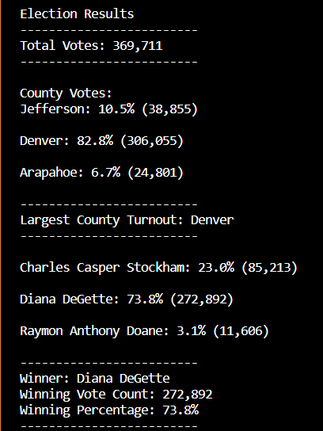

# Election_Analysis
## Project Overview
An election commission in Colorado has asked us to provide them with an audit of their election data for a local congressional election.  The summary of this audit includes:
1.	Total number of votes cast.
2.	List of candidates who received votes.
3.	Total votes each candidate received.
4.	Percentage of votes for each candidate.
5.	The winner of the election by popular vote.
6.	The voter turnout for each county.
7.	The percentage of votes from each county.
8.	The county with the highest turnout.
9.	
## Resources
-	Data Source: election_results.csv
-	Software: Python and Visual Studio Code (VSC)

## Results
### Winning Candidate Audit
 The election analysis shows that: 
-	Total Votes Cast:  369,711

Candidates:
-	Charles Casper Stockham
-	Diana DeGette
-	Raymon Anthony Doane

Results for each Candidate:
-	Charles Casper Stockham received 85,213 votes: 23% of total votes.
-	Diana DeGette received 272,892 votes: 73.8% of total votes.
-	Raymon Anthony Doane received 11,606 votes: 3.1% of total votes.

The winner based on popular vote:
-	Diana DeGette won with 272,892 votes or 73.8% of the total votes. 

### Votes by County
-	Jefferson: 10.5% (38,213 votes)
-	Denver: 82.8% (272,892 votes)
-	Arapahoe: 6.1% (11,606 votes)

The largest county turnout of voters was in Denver.

## Summary

As you can see above, using Python was a fast and clean way to determine the winner of this congressional election. It also allowed me to determine the county with the highest turnout of voters, which could be useful data for the next election. While I was reviewing the data, I realized that by altering the code above, I could even provide the statistics of votes per candidates by county. 

Aside from this election data, the code created to run this analysis can be useful to you for other elections such as county official elections and even a state governor election. The structure and organization of the code is reusable by just changing the names of the dictionaries and lists within the code to match the new set of data. You could even add on to it to include results for other factors such as what method of voting was used to cast the vote. I hope to hear from you again soon. 
